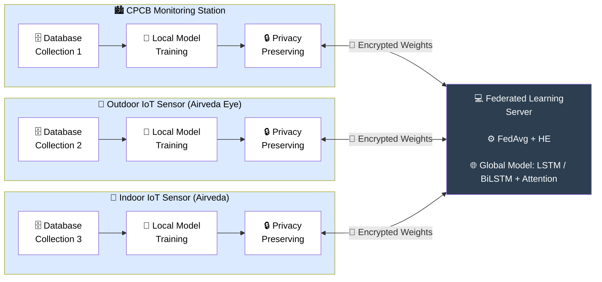

<div align="center">

# 🌫️ FedLSTM-AQI

### FedLSTM-AQI: A Federated Deep Learning Framework for Air Quality Index Prediction


[](https://rdcu.be/fueqk)
[](https://doi.org/10.1007/s00500-026-11403-x)

</div>

---

## 📌 Introduction

FedLSTM-AQI is a federated deep learning framework built to predict the Air Quality Index while keeping each participant's raw data completely private. Air quality monitoring in a city like Jalandhar draws on very different data sources, from long-running government CPCB stations to short-term outdoor and indoor IoT sensors, and these sources rarely share the same time ranges or the same set of pollutants. Instead of pooling all of this sensitive data into one place, FedLSTM-AQI trains LSTM and BiLSTM with Attention models locally on each client and shares only encrypted model updates. A sample-proportional FedAvg strategy combines these updates into a single global model, and Paillier homomorphic encryption protects the output layer weights so that no readable parameters ever leave a client. The result is an accurate, reproducible, and privacy-preserving forecasting pipeline that works across genuinely heterogeneous data holders.

---

## 📖 Publication

> **FedLSTM-AQI: A Federated Deep Learning Framework for Air Quality Index Prediction** <br>
> Jaspal Kaur Saini, Manpreet Singh, Divya Bansal <br>
> *Soft Computing* — Springer Nature (Q2, I.F. = 2.5, Scopus, SCIE)

📄 **Read the Full Paper:** [https://rdcu.be/fueqk](https://rdcu.be/fueqk)
🔗 **DOI:** [https://doi.org/10.1007/s00500-026-11403-x](https://doi.org/10.1007/s00500-026-11403-x)

---

## 🏗️ Architecture



---

## ✨ Features

- 🔄 **End-to-end pipeline** — from raw CPCB data to denormalized AQI forecasts
- 📊 **CPCB-standard AQI** sub-index computation across 6 pollutants
- 🧠 **Two architectures** — LSTM & BiLSTM + Attention, both with Layer Norm, residual connections, dropout, and gradient-clipped Adam
- 🔬 **Statistical rigor** — 5 independent seeds (42, 123, 256, 789, 1024), reported as mean ± std with paired t-test significance
- 🤝 **Genuinely heterogeneous FL** — 3 real clients with differing time ranges and feature sets
- 🧩 **Structural zero-padding** for the feature-incomplete indoor client
- 🔐 **Paillier homomorphic encryption** on the output Dense layer
- 🚫 **Leakage-free** chronological split with Min-Max scaling
- 📈 **Full metric suite** — RMSE, MAE, RMSLE, MAPE, R² (normalized + AQI scale)

---

## 🗂️ Project Structure

```
AQI-JALANDHAR/
├── preprocess.py          # Timestamp correction + missing value interpolation
├── compute_aqi.py         # CPCB-standard AQI sub-index computation
├── lstm_training.py       # LSTM — 5-seed training + sensor validation
├── bilstm_training.py     # BiLSTM + Attention — 5-seed training + validation
├── federated_approach.py  # Federated Learning (FedAvg + Paillier HE)
└── requirements.txt
```

---

## 🚀 Quick Start

```bash
git clone https://github.com/SINGH-MANPREET-1708/AQI-JALANDHAR.git
cd AQI-JALANDHAR
pip install -r requirements.txt
```

### Run the pipeline

```bash
python preprocess.py          # jld_aqi.csv          → jld_aqi_filled.csv
python compute_aqi.py         # jld_aqi_filled.csv   → jld_aqi_with_aqi.csv
python lstm_training.py       # centralized LSTM baseline (5 seeds)
python bilstm_training.py     # centralized BiLSTM + Attention baseline
python federated_approach.py  # FedAvg over 5 rounds · 3 clients · Paillier HE
```

<details>
<summary>📋 <b>Step-by-step details</b></summary>

| Step | Script | Input → Output |
|------|--------|----------------|
| 1 | `preprocess.py` | Raw CPCB → interpolated data |
| 2 | `compute_aqi.py` | Filled data → AQI-labeled data |
| 3 | `lstm_training.py` | Trains 5 seeds, evaluates on CPCB test + Airveda sensors |
| 4 | `bilstm_training.py` | Same protocol, BiLSTM + Attention |
| 5 | `federated_approach.py` | FedAvg (5 rounds), Paillier HE on Dense layer, evaluates both global models |

</details>

---

## 📦 Dataset

The CPCB training dataset is **not bundled** here due to size. Download from:

- [CPCB AQI Repository](https://airquality.cpcb.gov.in/ccr/)
- [Kaggle Mirror](https://www.kaggle.com/datasets/abhisheksjha/time-series-air-quality-data-of-india-2010-2023)

> Filter for **Jalandhar, Punjab** after download.

Sensor datasets (Airveda outdoor + indoor, collected at NIT Jalandhar) are available from the corresponding author upon reasonable request.

---

## 🛠️ Requirements

```
numpy==1.23.5       scikit-learn==1.2.2
pandas==1.5.3       tensorflow==2.12.0
matplotlib==3.7.1   phe==1.5.0
seaborn==0.12.2
```

---

## 🙏 Acknowledgment

This work was supported by a **Seed Fund Grant** under the project *"Personalized Inhalation Estimation of Spatial-Temporally Distributed Air Pollutants and Recommendations for Healthy Lifestyle"* by **Dr. B. R. Ambedkar National Institute of Technology (NIT), Jalandhar**.

> 🌟 **Principal Investigator (PI): Dr. Jaspal Kaur Saini** <br>
> Recipient of the Seed Fund Grant under which this work was carried out.

**Manpreet Singh** contributed as a Summer Intern at NIT Jalandhar during the course of this work. The authors sincerely thank the institute for the necessary financial support.

---

## 📚 Citation

```bibtex
@article{saini2026fedlstmaqi,
  title   = {FedLSTM-AQI: a federated deep learning framework for air quality index prediction},
  author  = {Saini, Jaspal Kaur and Singh, Manpreet and Bansal, Divya},
  journal = {Soft Computing},
  year    = {2026},
  doi     = {10.1007/s00500-026-11403-x},
  url     = {https://doi.org/10.1007/s00500-026-11403-x},
  publisher = {Springer Nature}
}
```

---

<div align="center">

## 📬 Contact

**Er. Manpreet Singh**
B.Tech CSE (AI & ML) · DAV Institute of Engineering & Technology, Jalandhar
📧 mrsingh31524@gmail.com

📄 [**Read the Full Paper**](https://rdcu.be/fueqk) · 🔗 [**DOI**](https://doi.org/10.1007/s00500-026-11403-x)

⭐ *If this work helped you, consider starring the repo!*

</div>